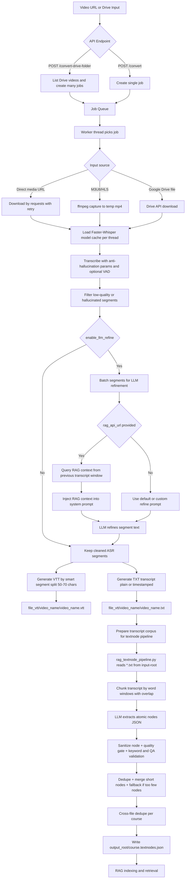

# Whisper API + RAG TextNode Pipeline

This repository contains two main pipelines:

1. ASR pipeline: video -> subtitle `.vtt` + transcript `.txt`
2. TextNode pipeline: transcript `.txt` -> `.textnodes.json` for RAG

The current codebase is designed for production stability: worker queue, job recovery after restart, download retries, hallucination filtering, and quality gates for TextNode generation.

## 1) Architecture Overview

- API server: FastAPI (`api.py`, `main.py`)
- Core ASR pipeline: `pipeline.py`
- Request/response schemas: `schemas.py`
- TextNode pipeline for RAG: `rag_textnode_pipeline.py`
- ASR output folder: `file_vtt/<video_name>/...`
- Default TextNode input folder: `file_transcript/...`

Note: the ASR pipeline and the TextNode pipeline are separated. ASR writes `.txt` into `file_vtt/...`, while the TextNode pipeline reads `.txt` from `file_transcript/...` (you can copy/sync transcripts there, or change `--input-root`).

## 2) ASR Pipeline (video -> VTT/TXT)

### 2.1 Supported Inputs

- Direct media URL (`.mp4`, `.avi`, `.mov`, ...)
- M3U8/HLS stream
- Google Drive file link
- Google Drive folder link (batch endpoint only: `/convert-drive-folder`)

### 2.2 Execution Flow in `process_video_transcription`

1. A worker pulls a job from `_job_queue`.
2. Media download:
   - Direct link: `requests.get(..., stream=True)` with retries
   - M3U8: `ffmpeg -i ... -c copy ...`
   - Google Drive: Drive API + `MediaIoBaseDownload`
3. Load Faster-Whisper from thread-local model cache (`_get_thread_model`).
4. Transcribe with anti-hallucination parameters and optional VAD.
5. Filter low-quality segments (`validate_segment_quality`) and clean repetition (`clean_repetitive_text`).
6. Optional LLM refinement (`enable_llm_refine=true`):
   - Split into segment batches
   - Call LLM proxy (`/v1/chat/completions` + fallback endpoints)
   - If `rag_api_url` exists: query RAG context from previous segment window and inject into system prompt
7. Generate outputs:
   - `.vtt`: smart split around 50-70 chars/segment (`smart_segment_split`)
   - `.txt`: clean transcript (with/without timestamps via `txt_include_timestamps`)
8. Update `jobs_status` and persist result stores.

### 2.3 API Endpoints

#### `GET /health`

Returns server status + ffmpeg availability + queue/worker metrics.

#### `POST /convert`

Queue one video conversion job.

Minimal request:

```json
{
  "video_url": "https://example.com/video.mp4",
  "language": "vi"
}
```

Full request (main fields):

```json
{
  "video_url": "https://example.com/video.mp4",
  "language": "vi",
  "model": "large-v3-turbo",
  "enable_vad": true,
  "condition_on_previous_text": false,
  "beam_size": 5,
  "patience": 1.0,
  "length_penalty": 1.0,
  "repetition_penalty": 1.0,
  "no_repeat_ngram_size": 0,
  "temperature": 0.0,
  "compression_ratio_threshold": 2.4,
  "log_prob_threshold": -1.0,
  "no_speech_threshold": 0.6,
  "enable_llm_refine": true,
  "llm_proxy_url": "http://127.0.0.1:5000",
  "llm_model": "Qwen/Qwen3-8B-AWQ",
  "llm_timeout_seconds": 60,
  "refine_batch_size": 20,
  "prompt_template": null,
  "txt_include_timestamps": false,
  "subject": "Marxist-Leninist Philosophy",
  "rag_api_url": "http://127.0.0.1:9100",
  "rag_context_window": 5
}
```

#### `POST /convert-drive-folder`

Queue all video files from a Google Drive folder.

```json
{
  "folder_url": "https://drive.google.com/drive/folders/<FOLDER_ID>",
  "language": "vi",
  "enable_llm_refine": true
}
```

#### `GET /status/{job_id}`

Get job status and result payload.

#### `GET /list`

List generated `.vtt`/`.txt` files in `file_vtt`.

#### `GET /download/{filename}`

Download generated output files.

#### `DELETE /jobs/{job_id}`

Remove a job from memory store.

### 2.4 Job Store and Queue Behavior

- Job status is persisted in `file_vtt/.jobs_status.json`
- Job payload is persisted in `file_vtt/.job_payloads.json`
- On server restart:
  - `queued/processing` jobs are marked failed if payload recovery is impossible
  - recoverable jobs are re-queued automatically
- Queue capacity: `JOB_QUEUE_MAXSIZE` (default `max(100, env_or_2000)`)

## 3) TextNode Pipeline (transcript -> textnodes for RAG)

Script: `rag_textnode_pipeline.py`

### 3.1 Goal

Convert transcript `.txt` files into high-quality TextNode JSON for RAG:

- atomic node granularity (one main idea per node)
- remove fillers/meta-discourse/ASR noise
- valid keywords/topics/question templates
- aggressive deduplication

### 3.2 Execution Flow

1. Scan all `.txt` under `--input-root`.
2. Group files by course folder (first-level directory).
3. For each file:
   - Chunk transcript (`split_transcript_for_llm`)
   - Call LLM for JSON node extraction (`call_llm_for_textnodes`)
   - Run `sanitize_node`:
     - text cleaning
     - quality gate (length, source overlap, unique ratio)
     - normalize category/keywords/questions
     - optional provenance (`source_coverage`, `source_quote`)
4. Deduplicate per file + merge short nodes + deduplicate again.
5. Fallback mode for long transcripts that collapse to too few nodes (smaller chunks + force multi-node).
6. If any LLM error happens in a file: retry whole file via `--file-max-retries`.
7. Cross-file dedupe at course level.
8. Write one aggregated output per course:
   - `output_root/<course>.textnodes.json`

### 3.3 Run the Script

Basic example:

```bash
python3 rag_textnode_pipeline.py \
  --input-root file_transcript \
  --output-root file_textnodes \
  --llm-proxy-url http://127.0.0.1:5000 \
  --llm-model Qwen/Qwen3-8B-AWQ
```

Recommended quality-oriented run:

```bash
python3 rag_textnode_pipeline.py \
  --input-root file_transcript \
  --output-root file_textnodes \
  --llm-proxy-url http://127.0.0.1:5000 \
  --llm-model Qwen/Qwen3-8B-AWQ \
  --include-provenance \
  --quality-min-words 28 \
  --quality-min-overlap 0.52 \
  --quality-min-unique-ratio 0.30 \
  --dedupe-threshold 0.76 \
  --file-max-retries 2
```

### 3.4 TextNode Output Format

Each node looks like:

```json
{
  "id": "uuid",
  "text": "Cleaned academic content",
  "metadata": {
    "subject": "...",
    "page": null,
    "topic": "...",
    "category": "Theory",
    "keywords": ["..."],
    "has_code": false,
    "file_name": "...txt",
    "question_templates": ["..."],
    "source_coverage": 0.63,
    "source_quote": "..."
  }
}
```

`source_coverage` and `source_quote` are included only when `--include-provenance` is enabled.

## 4) Complete Diagram: Video -> TextNodes for RAG



## 5) Quick Start with Docker

Build and run API:

```bash
docker compose up -d --build
```

Check logs:

```bash
docker compose logs -f whisper-api
```

Health check:

```bash
curl http://127.0.0.1:8000/health
```

Stop:

```bash
docker compose down
```

## 6) Important Environment Variables

- `LLM_PROXY_URL` (schema/code default: `http://host.docker.internal:5000`)
- `RAG_API_URL` (default: empty)
- `TRANSCRIPTION_WORKERS`
- `WHISPER_NUM_WORKERS`
- `JOB_QUEUE_MAXSIZE`
- `DOWNLOAD_MAX_RETRIES`
- `DOWNLOAD_RETRY_DELAY_SECONDS`
- `DIRECT_DOWNLOAD_CONNECT_TIMEOUT`
- `DIRECT_DOWNLOAD_READ_TIMEOUT`
- `GOOGLE_API_RETRIES`
- `GOOGLE_DRIVE_API_KEY` (if you do not use service account JSON)

## 7) Google Drive Credentials

Place `credentials.json` in project root.

Supported modes:

- Service account JSON (recommended)
- JSON with `api_key`/`key`
- Environment variable `GOOGLE_DRIVE_API_KEY`

If you use a service account, share Drive files/folders with the service account email.

## 8) Recommended Operational Sequence for RAG Data

1. Call `/convert` or `/convert-drive-folder` to generate transcript `.txt`.
2. Move/sync transcripts into the folder consumed by `rag_textnode_pipeline.py` (`file_transcript` or custom `--input-root`).
3. Run `rag_textnode_pipeline.py` to generate `.textnodes.json`.
4. Index generated textnodes in your RAG system.
