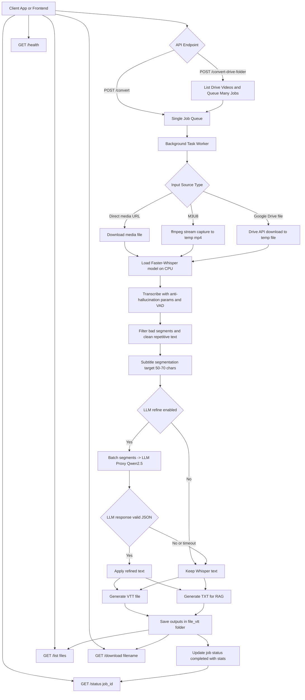

# Whisper API

API chuyển video thành phụ đề `VTT` và transcript `TXT` bằng Faster-Whisper, hỗ trợ:

- Link media trực tiếp (`.mp4`, `.m3u8`, ...)
- Google Drive file/folder
- LLM refine (Qwen2.5 qua proxy) để tăng chất lượng transcript
- Output `TXT` tối ưu cho RAG chatbot

## 1) Tính năng chính

- Transcribe tiếng Việt/Anh với cấu hình chống hallucination.
- Subtitle segmentation tối ưu hiển thị video (mục tiêu 50-70 ký tự/segment).
- Sinh đồng thời:
  - `*.vtt` để gắn video
  - `*.txt` để ingest RAG
- Hỗ trợ Google Drive:
  - `/convert`: Drive file link
  - `/convert-drive-folder`: quét toàn bộ video trong folder
- Tùy chọn refine text qua LLM proxy (Qwen2.5-7B).

## 2) Cấu trúc thư mục

```text
whisper-api/
├── api.py
├── pipeline.py
├── schemas.py
├── main.py
├── Dockerfile
├── docker-compose.yml
├── requirements.txt
├── credentials.json
├── file_vtt/
└── models/
```

## 3) Chạy bằng Docker

Yêu cầu:

- Docker + Docker Compose
- Host có ffmpeg (trong image đã cài)

Chạy:

```bash
docker compose up -d --build
```

Xem logs:

```bash
docker compose logs -f whisper-api
```

Kiểm tra health:

```bash
curl http://127.0.0.1:8000/health
```

## 4) Dùng với Nginx

Ví dụ reverse proxy:

```nginx
location / {
    proxy_pass http://127.0.0.1:8000;
    proxy_http_version 1.1;
    proxy_set_header Host $host;
    proxy_set_header X-Real-IP $remote_addr;
    proxy_set_header X-Forwarded-For $proxy_add_x_forwarded_for;
    proxy_set_header X-Forwarded-Proto $scheme;
    client_max_body_size 1000m;
}
```

## 5) Google Drive credentials

Đặt `credentials.json` tại root project.

Hỗ trợ:

- Service account JSON (khuyến nghị)
- Hoặc JSON có trường `api_key` (dùng cho tài nguyên public)

Có thể dùng env thay thế:

- `GOOGLE_DRIVE_API_KEY`

Lưu ý:

- Nếu dùng service account, cần share folder/file Drive cho email service account.

## 6) LLM refine (Qwen2.5 qua proxy)

Mặc định app bật refine (`enable_llm_refine=true`).

Trong `docker-compose.yml` đã set:

- `LLM_PROXY_URL=http://127.0.0.1:5000`

Bạn có thể override theo request hoặc env.

## 7) API Endpoints

### `GET /health`

Health check.

### `POST /convert`

Convert 1 video link (direct link hoặc Drive file).

Request mẫu:

```json
{
  "video_url": "https://example.com/video.mp4",
  "language": "vi",
  "model": "large-v3-turbo",
  "enable_llm_refine": true,
  "llm_proxy_url": "http://127.0.0.1:5000",
  "llm_model": "Qwen/Qwen2.5-7B-Instruct",
  "llm_timeout_seconds": 60,
  "refine_batch_size": 20,
  "txt_include_timestamps": false,
  "prompt_template": null,

  "enable_vad": true,
  "condition_on_previous_text": false,
  "beam_size": 5,
  "patience": 1.0,
  "length_penalty": 1.0,
  "repetition_penalty": 1.0,
  "no_repeat_ngram_size": 0,
  "temperature": 0.0,
  "compression_ratio_threshold": 2.4,
  "log_prob_threshold": -1.0,
  "no_speech_threshold": 0.6
}
```

Drive file ví dụ:

```json
{
  "video_url": "https://drive.google.com/file/d/FILE_ID/view?usp=sharing",
  "language": "vi"
}
```

### `POST /convert-drive-folder`

Queue toàn bộ video trong folder Drive.

```json
{
  "folder_url": "https://drive.google.com/drive/folders/1g-ZDze6jVI_Y418_O7vHh7QPqI0JXOjq",
  "language": "vi",
  "enable_llm_refine": true
}
```

### `GET /status/{job_id}`

Xem trạng thái job.

### `GET /list`

Liệt kê file output (`VTT`, `TXT`).

### `GET /download/{filename}`

Tải file output.

### `DELETE /jobs/{job_id}`

Xóa job khỏi memory.

## 8) Prompt template cho mixed content (VI + EN + code + LaTeX)

Bạn có thể truyền `prompt_template` để kiểm soát refine chặt hơn theo domain.

Ví dụ template ngắn:

```text
Bạn là bộ hậu xử lý transcript.
- Chỉ sửa chính tả, dấu câu, chữ hoa/thường.
- Giữ nguyên thuật ngữ tiếng Anh, code, biểu thức LaTeX.
- Không dịch ngôn ngữ.
- Không thêm bớt ý.
- Trả về JSON array [{"id":int,"text":"..."}] duy nhất.
```

Khuyến nghị:

- Video thiên về coding/math: luôn set `prompt_template` custom.
- Video thường: có thể dùng default template.

## 9) TXT cho RAG

Mặc định `txt_include_timestamps=false` để tạo transcript sạch, dễ chunking cho RAG.

Khi cần giữ ngữ cảnh thời gian, set:

- `txt_include_timestamps=true`

## 10) Vận hành nhanh

Redeploy sau khi sửa code:

```bash
docker compose up -d --build
```

Restart service:

```bash
docker compose restart whisper-api
```

Dừng service:

```bash
docker compose down
```

---



Nếu bạn muốn, mình có thể bổ sung thêm phần "preset prompt theo loại video" (lecture/coding/math) ngay trong API để gọi tiện hơn, không cần gửi `prompt_template` mỗi lần.
