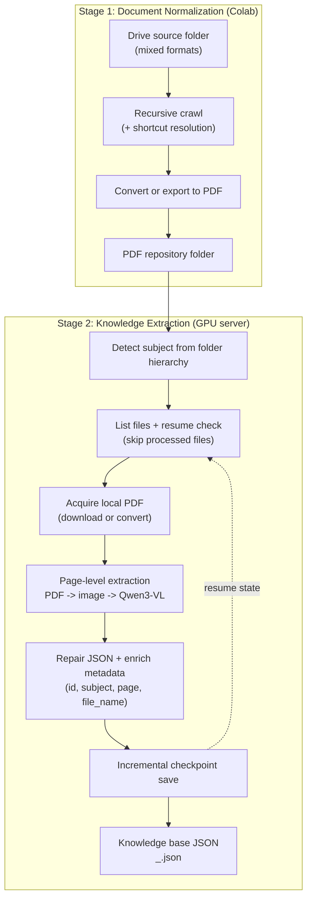

# 📚 PDF Knowledge Base Extraction Pipeline

Hệ thống 2 bước để tự động xây dựng Knowledge Base từ kho tài liệu hỗn hợp trên Google Drive bằng mô hình Vision-Language **Qwen3-VL**.

---

## 🧭 Tổng quan kiến trúc

Pipeline gồm **2 giai đoạn** chạy tuần tự:



> Mermaid source file for reuse: `diagram_pdf_pipeline_ieee.mmd`

---

## ✨ Tính năng chính

**Giai đoạn 1 — Colab Converter:**
- Duyệt đệ quy toàn bộ thư mục, kể cả **Google Drive Shortcut**
- Tự động phân loại và xử lý: Google Apps, Office, PDF gốc
- Bỏ qua video, audio, ảnh, file nén, file thực thi
- Convert Office → PDF qua **LibreOffice** (headless) ngay trên Colab
- Resume: bỏ qua file đã có sẵn trong thư mục đích

**Giai đoạn 2 — GPU Pipeline (`main.py`):**
- **Tự động nhận diện môn học** bằng cách leo ngược cây thư mục Google Drive
- **OCR thông minh** kết hợp nhận dạng hình ảnh bằng mô hình Qwen3-VL-8B
- **Chuẩn hóa LaTeX tự động** cho công thức toán học
- **Trích xuất code** từ cả ảnh chụp màn hình
- **Resume hỗ trợ**: Bỏ qua file đã xử lý, tiếp tục từ điểm dừng nếu bị gián đoạn
- **Sửa JSON bị cắt cụt** bằng hàm `repair_json`

---

## 📗 Giai đoạn 1 — Convert tài liệu sang PDF (Colab)

### Mục đích
Kho dữ liệu gốc ("Sản phẩm của các nhóm") chứa nhiều định dạng hỗn hợp không đồng nhất. Notebook Colab này chuẩn hóa toàn bộ về PDF và lưu vào thư mục `Tai_lieu_PDF` trên Google Drive của bạn — làm đầu vào sạch cho Giai đoạn 2.

### Cách chạy

1. Mở notebook trên [Google Colab](https://colab.research.google.com/)
2. Chỉnh 2 biến ở đầu notebook:

```python
# Link thư mục nguồn (Drive của nhóm/tổ chức)
shared_folder_link = "https://drive.google.com/drive/folders/<FOLDER_ID>"

# Thư mục đích trên Drive cá nhân của bạn
target_folder = "/content/drive/MyDrive/Tai_lieu_PDF"
```

3. Chạy toàn bộ notebook. Colab sẽ tự xác thực tài khoản Google qua `auth.authenticate_user()`.

### Luồng xử lý

| Loại file | Hành động |
|---|---|
| Google Docs / Sheets / Slides / Drawings | Export PDF qua Drive API |
| Word, Excel, PowerPoint, ODT, ODP... | Download về Colab → Convert bằng LibreOffice |
| PDF gốc | Copy thẳng sang thư mục đích |
| Shortcut trỏ đến folder | Duyệt đệ quy vào folder đích |
| Shortcut trỏ đến file | Xử lý như file thường |
| Video, Audio, Ảnh, Zip, Exe... | **Bỏ qua hoàn toàn** |

### Các loại file bị bỏ qua

- **Video**: `.mp4`, `.avi`, `.mov`, `.mkv`, `.webm`,...
- **Audio**: `.mp3`, `.wav`, `.flac`, `.aac`,...
- **Ảnh**: `.jpg`, `.png`, `.gif`, `.svg`, `.webp`,...
- **Nén/Thực thi**: `.zip`, `.rar`, `.exe`, `.apk`,...
- **Google Apps không export được**: Forms, Sites, Maps

### Kết quả
Toàn bộ tài liệu được chuẩn hóa thành PDF, giữ nguyên cấu trúc thư mục con, lưu tại `MyDrive/Tai_lieu_PDF/`.

---

## ⚙️ Giai đoạn 2 — Trích xuất Knowledge Base (main.py)

### Cấu hình

Chỉnh sửa các hằng số ở đầu file `main.py`:

| Biến | Mô tả | Mặc định |
|---|---|---|
| `FOLDER_ID` | ID thư mục **Tai_lieu_PDF** trên Drive (output của Giai đoạn 1) | Đọc từ env `DRIVE_FOLDER_ID` |
| `CREDENTIALS_FILE` | File Service Account JSON của Google | `credentials.json` |
| `OUTPUT_FILE` | Tên file JSON đầu ra (cũ, không còn dùng) | `KNOWLEDGE_BASE_QWEN.json` |
| `LOCAL_MODEL_PATH` | Đường dẫn model Qwen3-VL cục bộ | `./models/Qwen3-VL-8B-Instruct` |

> **Lưu ý:** Tên file đầu ra thực tế được tạo tự động theo định dạng `<ten_mon>_<ten_folder>.json`.

---

## 🛠️ Yêu cầu hệ thống

### Phần cứng
- GPU **NVIDIA A100** (hoặc tương đương, tối thiểu ~20GB VRAM)
- RAM: ≥ 32GB

### Phần mềm & thư viện

```bash
pip install torch transformers qwen-vl-utils
pip install pymupdf pillow tqdm
pip install google-auth google-auth-oauthlib google-api-python-client
```

### Model
Tải model Qwen3-VL-8B-Instruct và đặt vào thư mục `./models/Qwen3-VL-8B-Instruct/`.

```bash
huggingface-cli download Qwen/Qwen3-VL-8B-Instruct \
  --local-dir ./models/Qwen3-VL-8B-Instruct
```

---

## 🔐 Xác thực Google Drive

1. Tạo **Service Account** trên [Google Cloud Console](https://console.cloud.google.com/)
2. Cấp quyền **Google Drive API** cho Service Account
3. Tải file `credentials.json` và đặt cùng thư mục với `main.py`
4. Chia sẻ thư mục Google Drive với email của Service Account

---

## 🚀 Cách chạy (end-to-end)

**Bước 1:** Chạy notebook Colab để chuẩn hóa tài liệu sang PDF (xem mục Giai đoạn 1 ở trên).

**Bước 2:** Lấy Folder ID của thư mục `Tai_lieu_PDF` vừa tạo, sau đó chạy `main.py` trên GPU server:

```bash
# Truyền Folder ID của Tai_lieu_PDF
export DRIVE_FOLDER_ID="folder_id_cua_Tai_lieu_PDF"

python main.py
```

---

## 📤 Định dạng đầu ra

File JSON đầu ra là một mảng các **TextNode**, mỗi node đại diện cho một đoạn kiến thức trong tài liệu:

```json
[
  {
    "id_": "uuid-tự-sinh",
    "text": "Nội dung chi tiết của đoạn, có thể gồm LaTeX ($E=mc^2$) hoặc code block.",
    "metadata": {
      "file_name": "ten_file_goc.pdf",
      "subject": "Tên môn học",
      "page": 3,
      "topic": "Tên chủ đề cụ thể",
      "category": "Algorithm | Theory | Example",
      "keywords": ["keyword1", "keyword2"],
      "has_code": false
    }
  }
]
```

---

## 🔄 Luồng xử lý chi tiết

### 1. Xác định tên môn học
Hàm `find_subject_recursive` leo ngược tối đa 6 cấp thư mục để tìm tên môn học dựa trên từ khóa (ví dụ: "Môn", "course", "học phần"...). Các folder trung gian như "Slides", "PDF", "Chương" bị bỏ qua.

### 2. Tải & chuyển đổi tài liệu
- Google Docs/Slides: Export trực tiếp sang PDF qua API
- File Word/PPT upload: Cố gắng Export, thông báo nếu thất bại
- PDF gốc: Tải thẳng về

### 3. Xử lý PDF với Qwen3-VL
Mỗi trang PDF được:
1. Render thành ảnh PNG ở 200 DPI bằng PyMuPDF
2. Đưa vào Qwen3-VL kèm prompt chi tiết
3. Mô hình sinh ra JSON chứa các TextNode
4. JSON được làm sạch & sửa lỗi bằng `repair_json`

### 4. Resume & Lưu trữ
Sau mỗi file, kết quả được ghi ngay vào file JSON đầu ra. Nếu pipeline bị ngắt, lần chạy tiếp theo sẽ tự động bỏ qua các file đã xử lý.

---

## 📝 Lưu ý khi sử dụng

- File Word/PPT upload lên Drive **đôi khi không thể convert** sang PDF trên server Linux. Nên upload trực tiếp dạng PDF hoặc dùng Google Docs/Slides.
- Model được load với `torch_dtype=bfloat16` và `attn_implementation="sdpa"` để tối ưu tốc độ trên A100.
- Mỗi trang sinh tối đa **6144 token**, đủ cho các trang tài liệu dày.
- VRAM được giải phóng sau mỗi trang (`torch.cuda.empty_cache()`) để tránh OOM.